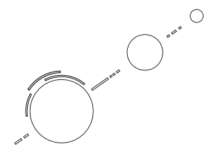

# Database Anime [ [Rus](./README.md) | Eng ]

### Intro

**DatabaseAnime** - is program for management of your anime, manga, amv and dorama
which you ever watched, you want to look or simply heard about them, actually
you can define *as* and *for what* to use the program.

Is is my first project on **Qt**, difficult features can is entered long enough.

Idea, design and testing of application - [Maxx Volniy](https://vk.com/id233189085)

Idea of a logo of the application: [Pavel Enotin](https://vk.com/everydayiamsuffering)

### Install
- Download last stable [release](https://github.com/LibertaSoft/DatabaseAnime/releases) for your system
- Compile from source code.
  - Files with the translations have to lie in an application directory (qtbase_??.qm, DatabaseAnime_??.qm)

### Develop
- In future versions it is planned: [ToDo](./ToDo.md)
- If found a error [create new issue](https://github.com/LibertaSoft/DatabaseAnime/issues/new)

### Contacts
- Group: [ВКонтакте](https://vk.com/db_anime)
- eMail: [LibertaSoft@ya.ru](mailto:libertasoft@ya.ru)

### License
- DatabaseAnime licensed by [GNU GPLv3](./LICENSE)

### Donation
*We will be very grateful if you send the decimal sum to one of these purses*
- **Yandex money:**
  - 410012424335934
- **WebMoney:**
  - R368213390629
  - Z559048928381
